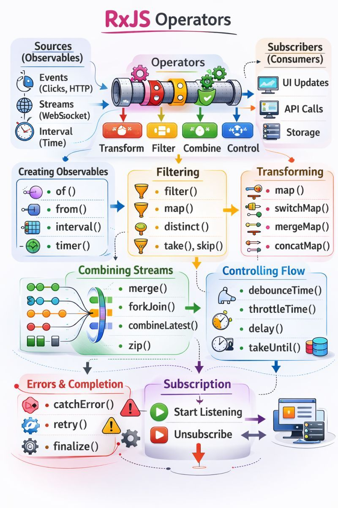

Understanding Observables doesn’t just improve your code…
 It changes the way you think about frontend development.
 From:
 ✅ Handling HTTP calls
 ✅ Managing reactive forms
 ✅ Avoiding nested subscriptions
 ✅ Controlling async workflows
 ✅ Managing state with BehaviorSubject
RxJS makes Angular applications more scalable, maintainable, and predictable — when used the right way.
The real power lies in operators like:
 🔹 switchMap() → cancel previous requests automatically
 🔹 debounceTime() → optimize performance (especially search inputs)
 🔹 catchError() → handle failures gracefully
 🔹 takeUntil() → prevent memory leaks
Before RxJS, async logic feels messy.
 After understanding operators, everything becomes structured and reactive.
As an Angular developer, mastering RxJS is not just about learning syntax.
It’s about:
 👉 Thinking in streams
 👉 Managing side effects properly
 👉 Writing cleaner, more maintainable code
 👉 Building production-ready applications
 Still learning | Still improving | Still refining my reactive mindset 💡
What’s the RxJS operator that changed your workflow the most?

