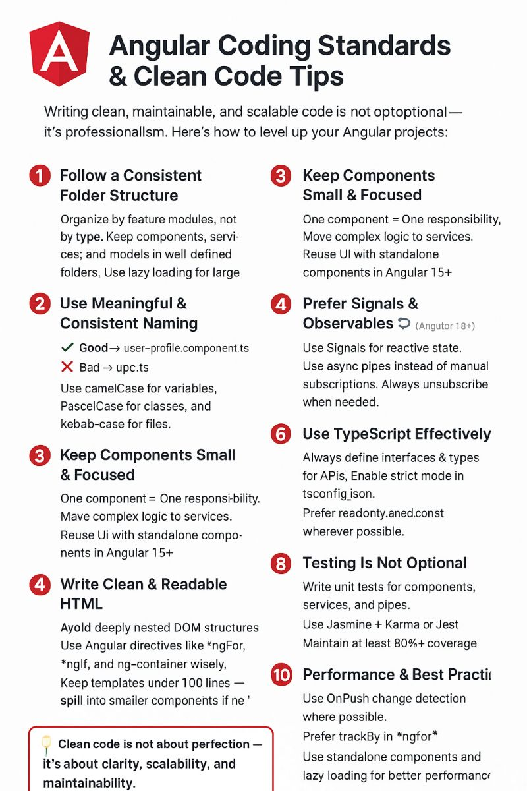
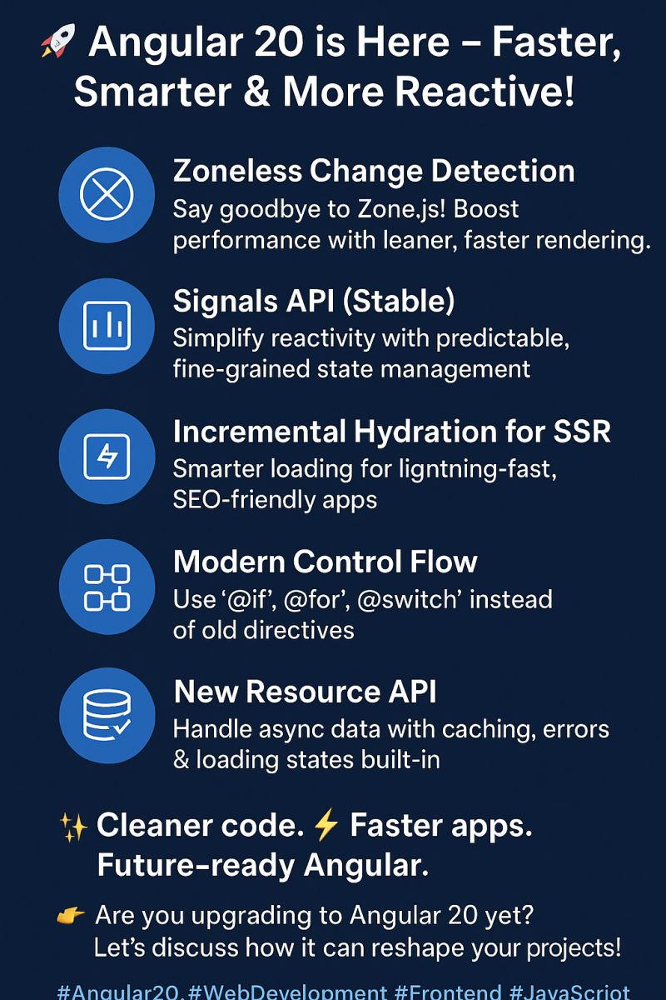

Top 10 Angular Coding Standards & Clean Code Tips every developer should follow:

✅ Follow a Consistent Folder Structure → Organized code = productive teams.
✅ Use Meaningful Naming → No more abc.ts or xyz.ts. Be clear & readable.
✅ Keep Components Small & Focused → One responsibility, one component.
✅ Leverage Signals & Observables → Stay ahead with Angular 16+ reactivity.
✅ Write Clean HTML → Simple, readable, and accessible templates.
✅ TypeScript Best Practices → Strong typing = fewer runtime surprises.
✅ Handle Errors Smartly → Interceptors + meaningful messages.
✅ Testing Is NOT Optional → Stable apps = reliable codebase.
✅ Linting & Formatting → Automate code style for consistency.
✅ Performance Matters → OnPush, trackBy, lazy loading… every millisecond counts! ⏳

💡 Pro Tip: Clean code is not about perfection — it’s about clarity, scalability, and maintainability.

 Angular 20 is Here – Faster, Smarter & More Reactive!

1️⃣ Zoneless Change Detection – Say goodbye to Zone.js! Boost performance with leaner, faster rendering.
2️⃣ Signals API (Stable) – Simplify reactivity with predictable, fine-grained state management.
3️⃣ Incremental Hydration for SSR – Smarter loading for lightning-fast, SEO-friendly apps.
4️⃣ Modern Control Flow – Use @if, @for, @switch instead of old directives.
5️⃣ New Resource API – Handle async data with caching, errors & loading states built-in.

two ways:

first: -> Install a particular Angular CLI version globally

npm install @angular/cli@21.0.0-next.2

ng version

second:-> Create a new Angular project with a specific version( so locally)

npx @angular/cli@21.0.0-next.2 new my-app

https://stackblitz.com/edit/angular-form-array-directive?file=src%2Fmain.ts

Check available Angular versions

npm view @angular/cli versions

LLM Prompts and AI IDE setup

https://angular.dev/ai/develop-with-ai

- Do NOT use the `@HostBinding` and `@HostListener` decorators. Put host bindings inside the `host` object of the `@Component` or `@Directive` decorator instead

tree-shaking

