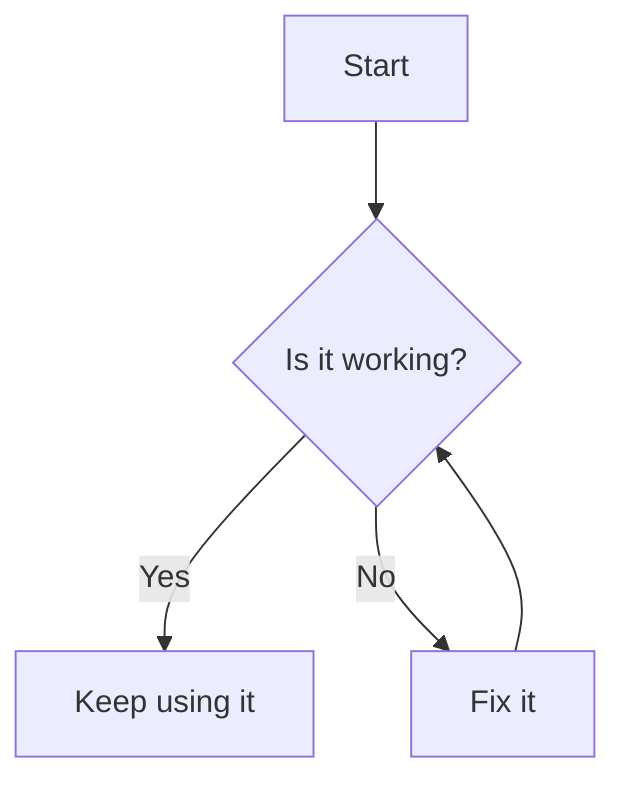
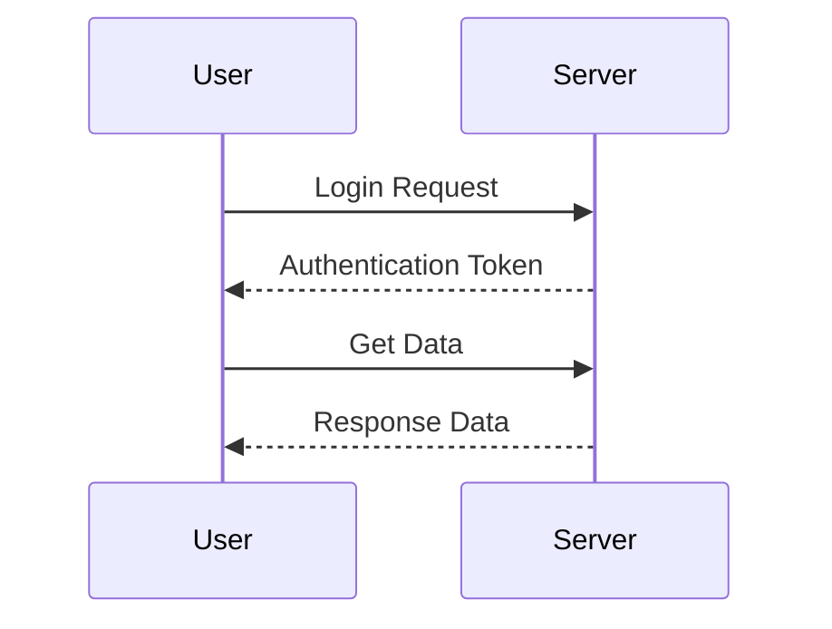
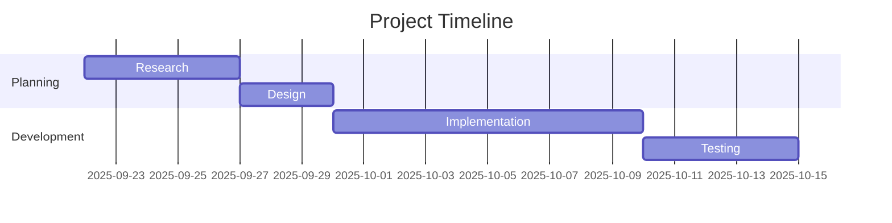
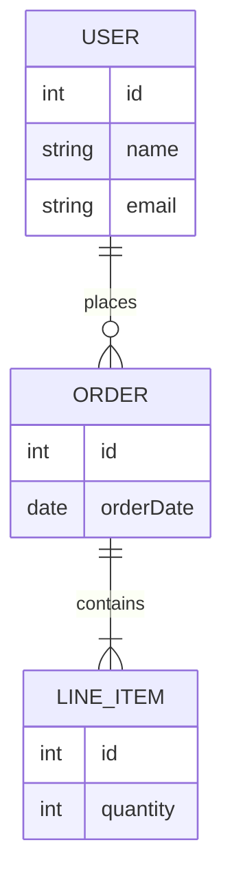
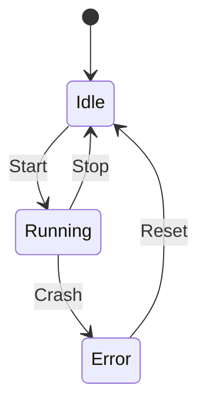
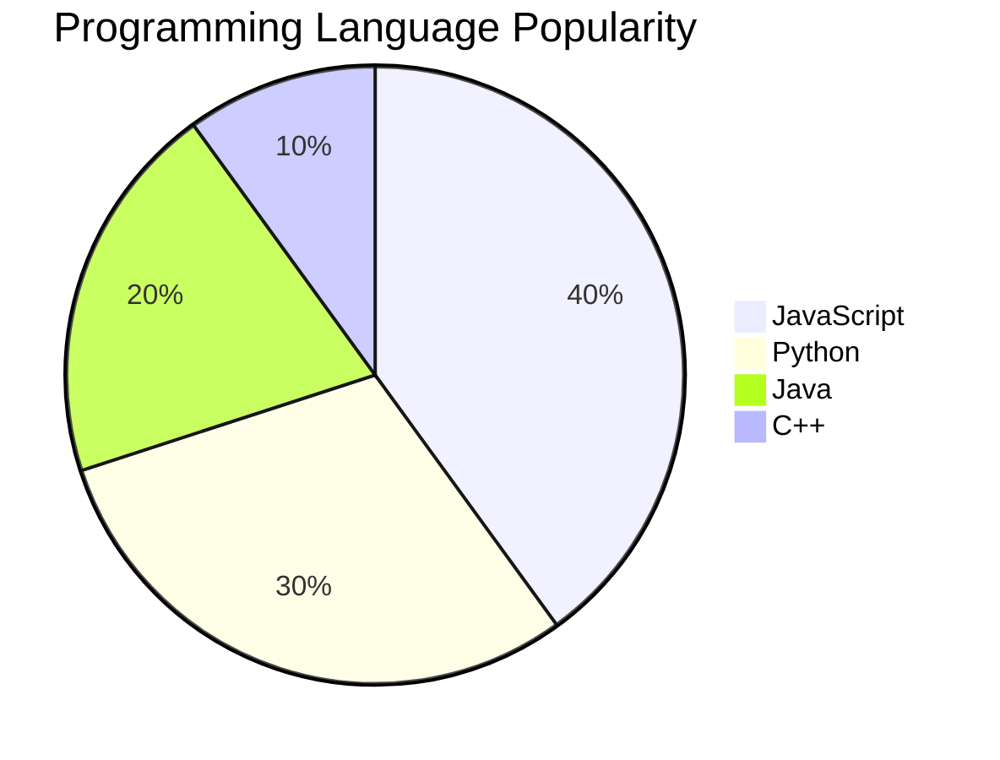
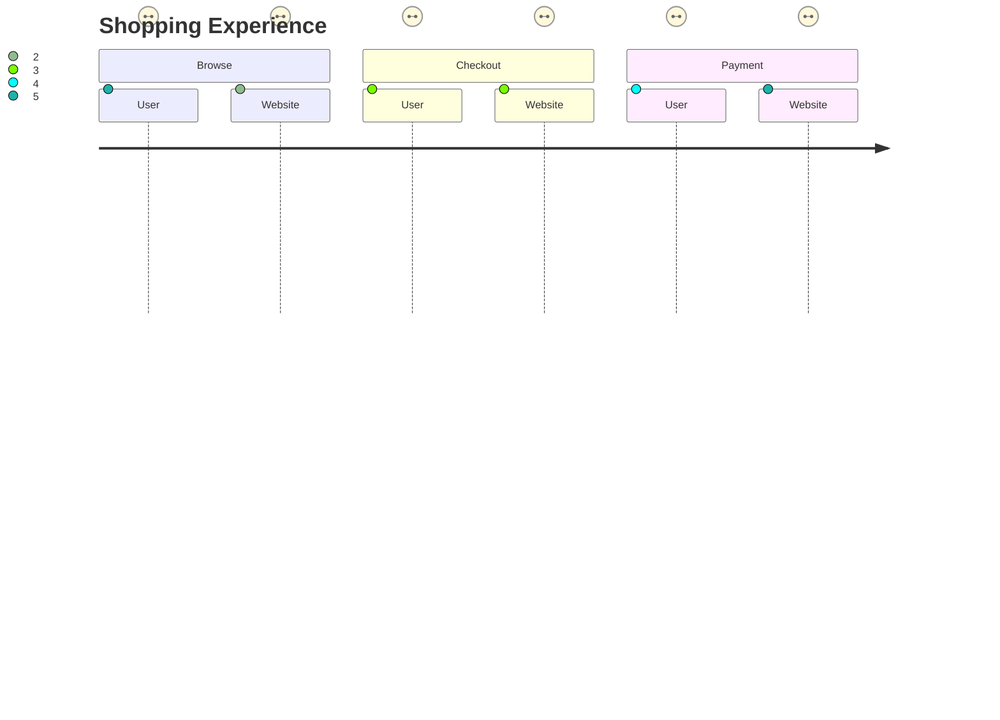

# 📌 Mermaid Diagrams Cheat Sheet

## 1. Flowchart

---

## 2. Sequence Diagram

---

## 3. Gantt Chart

---

## 4. ER Diagram (Database)

---

## 5. State Diagram

---

## 6. Pie Chart

---

## 7. User Journey

